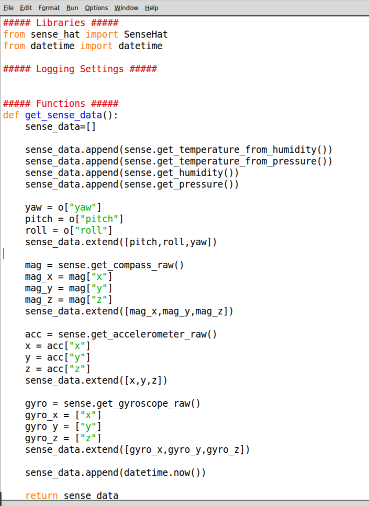

## Getting data from the Sense HAT

First you can write a short script to get data from the Sense HAT and output it to the screen. Using the sensors, you can capture the following data:

- Temperature
- Humidity
- Pressure
- Orientation
- Acceleration
- Magnetic Field

- Attach your Sense HAT to you Raspberry Pi.

[[[rpi-sensehat-attach]]]

- Once your Sense HAT is attached, boot your Raspberry Pi.

- Open Idle on your Raspberry Pi and create a new file to work in.

[[[rpi-gui-idle-opening]]]

- To begin this project, your will need to import the code to control your Sense HAT and you will also need a module to fetch the data and time from the Raspberry Pi. Start by adding these two lines of code.

```python
from sense_hat import SenseHat
from datetime import datetime

sense = SenseHat()
```

- In order to get data from the Sense HAT you will need to write a function called **get_sense_data** which will check each sensor in turn and store the sensor data in a list. The function should be added to the **Functions** section.

  ```python
  def get_sense_data():
      sense_data=[]

      sense_data.append(sense.get_temperature_from_humidity())
      sense_data.append(sense.get_temperature_from_pressure())
      sense_data.append(sense.get_humidity())
      sense_data.append(sense.get_pressure())
  ```
  The first line defines your function name, and the second sets up an empty **list** structure into which you will add your collected data.

  The next four lines get data from some of the sensors and adds (or appends) them to the `sense_data` list.

  The rest of the sensors are a bit more complex as they each give three values back. In the lines above you are asking the Sense HAT for the three orientation values (yaw, pitch, roll) and the second line extends the sense_data list by those three values.

  ```python
    o = sense.get_orientation()
    yaw = o["yaw"]
    pitch = o["pitch"]
    roll = o["roll"]
    sense_data.extend([pitch,roll,yaw])
  
    mag = sense.get_compass_raw()
    mag_x = mag["x"]
    mag_y = mag["y"]
    mag_z = mag["z"]
    sense_data.extend([mag_x,mag_y,mag_z])
    
    acc = sense.get_accelerometer_raw()
    x = acc["x"]
    y = acc["y"]
    z = acc["z"]
    sense_data.extend([x,y,z])

    gyro = sense.get_gyroscope_raw()
    gyro_x = gyro["x"]
    gyro_y = gyro["y"]
    gyro_z = gyro["z"]
    sense_data.extend([gyro_x,gyro_y,gyro_z])
    
    sense_data.append(datetime.now())

    return sense_data
  ```
  The final part of the function adds three more sensor values (magnetometer, accelorometer, and gyroscope), and then the current time. The final line of the function **returns** (or sends) the **sense_data** list to where the main program will ask for it.

- Next you'll need to add some lines to your **Main Program** Section, this will need to do two things:
  - create a sense object, which represents the Sense HAT
  - repeatedly **get_sense_data** from the sensors and display it

  Add the following code to your **Main Program** section:

  ```python3
  sense = SenseHat()

  while True:
      sense_data = get_sense_data()
      print(sense_data)
  ```

  Your final program should look like this:

  

- You can now test your logger. First you should save it: press **Ctrl+S** and chose a name such as `Sense_Logger_v1.py`. Once the program is saved you can run it by pressing **F5**. You should see lots of text scrolling past as shown below.

  

  The highlighted section shows a single line of data bundled together into a list, you should be able to tell which sensor data is which.

  To stop the program running you can press **Ctrl+C** to cancel the execution.

