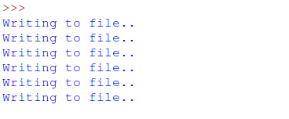

## Writing the data to a file

The program you have produced so far is able to continually check the Sense HAT sensors and write this data to the screen, however, unless you're a very fast reader this is not very helpful.

What would be more useful would be to write this data to a CSV (comma separated values) file, which you can examine once your logging program has finished. To create this file you will need to do the following:
  - specify the filename for this file
  - add a header row to the start of the file
  - convert each list of data into a line of text for the file
  - periodically write a batch of data out to the file

- The first thing you need to do is to add 2 lines to your **Settings** section. These are:

  ```python
  FILENAME = ""
  WRITE_FREQUENCY = 50
  ```

  The first line here will be used to choose an filename for the data output, and the second will set how often the program will write data out to the file. In this case it will collect 50 lines of data and then add these to the file in one go.

- Next you will need to add a **log_data** function, which will convert the **sense_data** to a line of comma seperated values ready to be written to the file. The line of text will be added to a list called **batch data**, which will store the data until it is written to the file.

  Add the following code after the **Functions** heading and before the **get_sense_data** function.

  ```python
  def log_data():
      output_string = ",".join(str(value) for value in sense_data)
      batch_data.append(output_string)
```

  The first line takes each value in the **sense_data** list and converts them to **strings** (text) and the joins them together with the `,` symbol. So a line like this:

  > [26.7224178314209, 25.068750381469727, 53.77205276489258, 1014.18017578125, 3.8002126669234286, 306.1720338870328, 0.3019065275890227, 71.13333892822266, 59.19926834106445, 39.75812911987305, 0.9896639585494995, 0.12468399852514267, -0.004147999919950962, -0.0013064055237919092, -0.0006561130285263062, -0.0011542239226400852, datetime.datetime(2015, 9, 23, 11, 53, 9, 267584)]

  gets converted to:

  > 26.7224178314209,25.068750381469727,53.77205276489258,1014.18017578125,3.8002126669234286,306.1720338870328,0.3019065275890227,71.13333892822266,59.19926834106445,39.75812911987305,0.9896639585494995,0.12468399852514267,-0.004147999919950962,-0.0013064055237919092,-0.0006561130285263062,-0.0011542239226400852,2015-09-23 11:53:09.267584

- Another function you will need is the **file_setup** function which will create a list of headings that will be written to the file before any data. The function is shown below and needs to be added to your **Functions** section.


  ```python
  def file_setup(filename):
      header  =["temp_h","temp_p","humidity","pressure",
      "pitch","roll","yaw",
      "mag_x","mag_y","mag_z",
      "accel_x","accel_y","accel_z",
      "gyro_x","gyro_y","gyro_z",
      "timestamp"]

      with open(filename,"w") as f:
          f.write(",".join(str(value) for value in header)+ "\n")
```

  This function is slightly different to the previous as it needs an input (or **parameter**) in order to work, in this case the input has been called `filename`. When the main program calls this function it must also give the function the name of the file to write to. If it were called like this `file_setup("output.csv")` the function would create `output.csv`

  The function itself creates a list of header names called header. It then opens a file in **write** mode (which will overwrites any previous data) and refers to that file as f. whilst the file is open it joins all the list headings together using commas and writes that line to the file.

- The two functions and the settings you added now need to be used in the main program.

  Straight after the lines that read:

  ```python
  ##### Main Program #####
  sense = SenseHat()
```

  add the following:

  ```python
  batch_data= []

  if FILENAME == "":
      filename = "SenseLog-"+str(datetime.now())+".csv"
  else:
      filename = FILENAME+"-"+str(datetime.now())+".csv"

  file_setup(filename)
```

  The first line here creates an empty list that the program will keep adding sense_data lines to until it reaches 50 (or whatever value is set by WRITE_FREQUENCY).

  The if/else block checks whether a FILENAME has been set, if it hasn't then the default of "SenseLog" is used. The current date and time is also added to the filename.

  Finally the **file_setup** functions is called and given the filename that was decided upon in the previous if / else block.

- The last step is to change some of the logic inside the `while True:` loop.
  - You need to make it collect **sense_data**
  - Then use the **log_data** function to convert the sense_data into csv form and add the the current **batch_data**.
  - Once the data is logged, the program checks whether the size of **batch_data** exceeds the WRITE_FREQUENCY setting, if so the data is written to a file and **batch_data** is reset.

  Your `while True:` loop should be updated to look like this:

  ```python
  while True:
      sense_data = get_sense_data()
      log_data()

      if len(batch_data) >= WRITE_FREQUENCY:
          print("Writing to file..")
          with open(filename,"a") as f:
              for line in batch_data:
                  f.write(line + "\n")
              batch_data = []
  ```

  - The line `print("Writing to file..")` is optional, but it will show whenever data is being written.
  - The line `with open(filename,"a") as f:` opens the file in **append** mode which adds the data at the end point of the file rather than overwriting.

  You can check your code against a full code listing [here](resources/Sense_Logger_v2.py).

  When you running the program you should simply see the messages saying `Writing to file..` every so often.

  

  You can stop logging by pressing **Ctrl+C**

