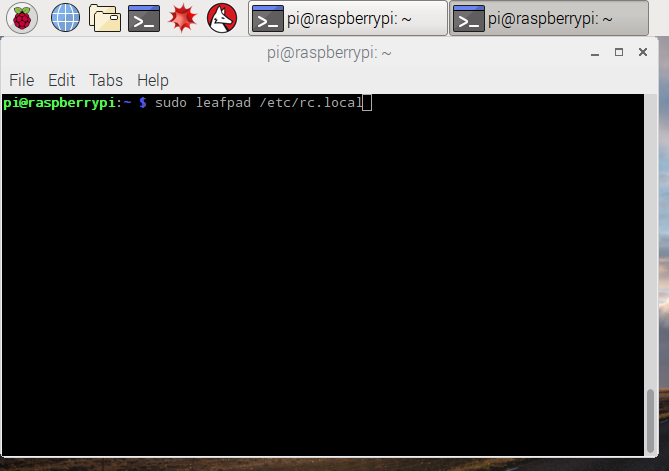

## Starting your data logger on boot.
It's quite likely that you will not want to have a screen, keyboard and mouse handy every time you want to log data. A handy way to avoid this is to have you program run whenever your Raspberry Pi boots up.
To do this you will first need to open a terminal window like the one below, and enter the command `sudo leafpad /etc/rc.local`. The `rc.local` script is the last startup script to load as the Raspberry Pi boots. Anything you add to this script will load on boot.

  

  Once Leafpad has loaded, you should add two lines like the ones shown here:

  

  - The first line changes to the directory where your datalogger script is stored.
  - The second line changes to the `pi` user  and runs the command `python3 Sense-Logger.py`, the `&` symbol makes this command run as a background task and allows the Raspberry Pi to continue with other tasks.

  You will need to update these lines to reflect the name and location of your program.

  The next time your Raspberry Pi boots it should automatically start logging data

